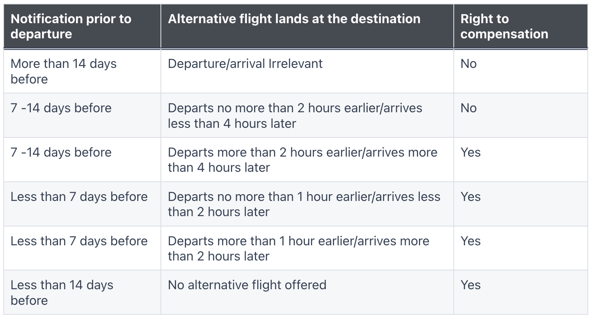
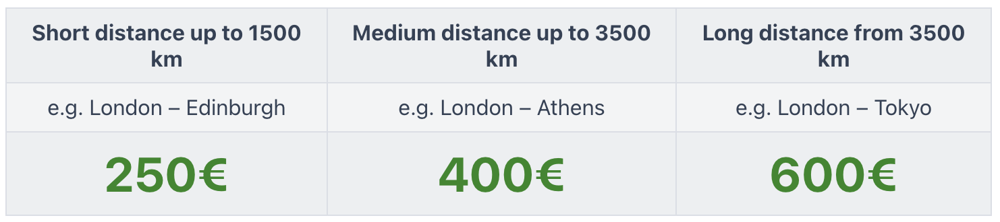

# Lufthansa Support Bot
This small example code illustrates how to use Python + Selenium to automatically create Lufthansa support tickets.  

It will open https://www.lufthansa.com/de/de/kompensation-bei-flugunregelmaessigkeiten and populate all the required fields with your provided inputs.  

Right now it works for the German version of the webpage and only for flight cancelations.  
However, it should be fairly easy to adapt it to any other Lufthansa form. ;-)  

# Why?
Unfortunately, I regularly have problems with Lufthansa, and the support often tries to brush me off. In my experience, only persistence helps with Lufthansa. With the help of this bot, I have created thousands of tickets with Lufthansa and have always had my demands met. It should be noted that my demands have always been in accordance with the law.  

If you want to read about one of these experiences, read my medium article:  
[Lufthansa's embarrassing attempt to automate its customer service, how it is worse than ChatGPT and my fight to be compensated according to EU regulations](https://medium.com/@michaelgorkow/lufthansas-embarrassing-attempt-to-automate-its-customer-service-b3838e4d0cef)

# What can you expect as compensation? 
I would always check the latest information online but currently (20.12.2023) this is what you can expect according to [flightright.de](https://www.flightright.com/your-rights/flight-cancellation)

